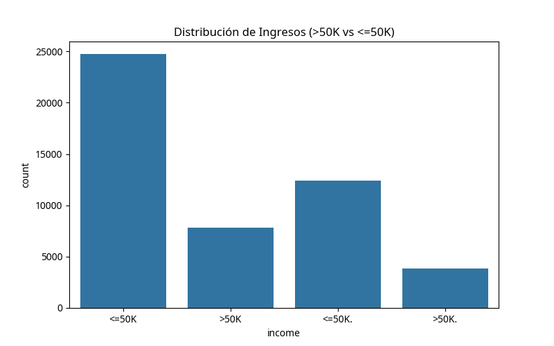
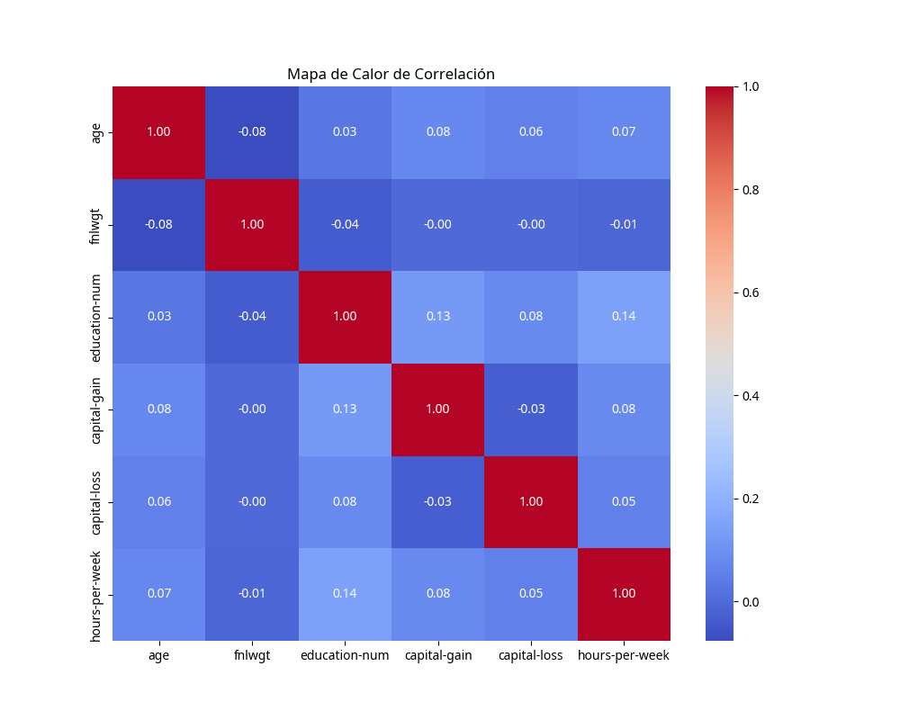

# Informe del Proyecto de Data Science: Predicción de Ingresos (Adult Census Income)

## 1. Introducción

Este proyecto universitario tiene como objetivo demostrar la aplicación de técnicas avanzadas de preprocesamiento de datos y modelado de Machine Learning, culminando en una aplicación interactiva desarrollada con Streamlit. El dataset seleccionado, **Adult Census Income**, es ideal para este propósito debido a su diversidad de tipos de datos, la presencia de valores faltantes y la necesidad de transformaciones complejas.

## 2. Selección y Justificación del Dataset

El dataset **Adult Census Income** (también conocido como Census Income) proviene del repositorio UCI Machine Learning [1]. Su objetivo es predecir si el ingreso anual de un individuo excede los $50,000 USD basándose en datos censales de 1994.

### 2.1. Características Clave del Dataset

*   **Datos Mixtos**: Contiene una combinación de variables numéricas (ej. `age`, `fnlwgt`, `education-num`, `capital-gain`, `capital-loss`, `hours-per-week`) y categóricas (ej. `workclass`, `education`, `marital-status`, `occupation`, `relationship`, `race`, `sex`, `native-country`). Esta heterogeneidad es fundamental para aplicar `ColumnTransformer`.
*   **Valores Faltantes**: Varias columnas, como `workclass`, `occupation` y `native-country`, presentan valores faltantes (originalmente marcados con "?"), lo que requiere la implementación de **técnicas de imputación**.
*   **Encoding Necesario**: Las variables categóricas requieren técnicas de codificación como `OneHotEncoder` (para variables con alta cardinalidad) y `LabelEncoder` (para la variable objetivo o binarias).
*   **Potencial para Reducción de Dimensionalidad**: Tras aplicar `OneHotEncoder` a múltiples variables categóricas, el número de características puede aumentar significativamente, haciendo que la **Reducción de Dimensionalidad** (ej. PCA) sea una técnica relevante para mejorar la eficiencia y el rendimiento del modelo.
*   **Problema de Clasificación**: La tarea de predicción es una clasificación binaria (ingresos >50K o <=50K), permitiendo la comparación de diferentes algoritmos de clasificación.

## 3. Análisis Exploratorio de Datos (EDA)

Se realizó un EDA inicial para comprender la estructura del dataset, identificar valores faltantes y visualizar la distribución de las variables clave. El script `eda_script.py` se encargó de esta fase.

### 3.1. Resumen de Valores Faltantes

El análisis reveló la presencia de valores faltantes en las siguientes columnas (originalmente marcados como '?'):

| Columna | Valores Faltantes |
| :-------------- | :---------------- | 
| `workclass` | 2799 |
| `occupation` | 2809 |
| `native-country` | 857 |

### 3.2. Distribución de la Variable Objetivo

La variable objetivo `income` muestra una distribución desequilibrada, con una mayoría de individuos en la categoría `<=50K`. Esto es un aspecto importante a considerar durante el modelado.



### 3.3. Mapa de Calor de Correlación

El mapa de calor de correlación entre las variables numéricas ayuda a identificar relaciones lineales. Se observa que `education-num` tiene una correlación positiva moderada con `capital-gain` y `hours-per-week`.



## 4. Preprocesamiento de Datos y Modelado de Machine Learning

La fase de preprocesamiento y modelado se implementó utilizando `sklearn.pipeline.Pipeline` y `sklearn.compose.ColumnTransformer` para asegurar un flujo de trabajo robusto y reproducible. El script `model_training.py` contiene la lógica para esta fase.

### 4.1. Arquitectura del Pipeline

El pipeline de preprocesamiento se estructuró de la siguiente manera:

*   **Transformador Numérico**: Aplicado a columnas numéricas.
    *   `SimpleImputer(strategy='median')`: Imputa valores faltantes con la mediana.
    *   `StandardScaler()`: Escala las características para que tengan media cero y varianza unitaria.
*   **Transformador Categórico**: Aplicado a columnas categóricas.
    *   `SimpleImputer(strategy='most_frequent')`: Imputa valores faltantes con el valor más frecuente.
    *   `OneHotEncoder(handle_unknown='ignore')`: Convierte variables categóricas en un formato numérico binario.
*   **ColumnTransformer**: Combina los transformadores numéricos y categóricos, aplicándolos a las columnas correspondientes.
*   **Reducción de Dimensionalidad (PCA)**: Se aplicó PCA con `n_components=50` para reducir la dimensionalidad de los datos transformados, especialmente después del OneHot Encoding, que puede generar un gran número de características.

### 4.2. Modelos de Machine Learning

Se entrenaron y evaluaron dos modelos de clasificación:

1.  **Regresión Logística (`LogisticRegression`)**: Un modelo lineal simple, útil como línea base.
2.  **Random Forest (`RandomForestClassifier`)**: Un modelo de conjunto robusto, conocido por su buen rendimiento en problemas de clasificación.

### 4.3. Resultados de los Modelos

Los modelos fueron evaluados en un conjunto de prueba (20% de los datos) y los resultados se resumen a continuación:

#### Regresión Logística

```
              precision    recall  f1-score   support

       <=50K       0.87      0.94      0.90      7414
        >50K       0.74      0.58      0.65      2355

    accuracy                           0.85      9769
   macro avg       0.81      0.76      0.78      9769
weighted avg       0.84      0.85      0.84      9769
```
Accuracy: 0.8492

#### Random Forest

```
              precision    recall  f1-score   support

       <=50K       0.88      0.93      0.91      7414
        >50K       0.73      0.61      0.66      2355

    accuracy                           0.85      9769
   macro avg       0.81      0.77      0.79      9769
weighted avg       0.85      0.85      0.85      9769
```
Accuracy: 0.8524

El modelo **Random Forest** mostró un rendimiento ligeramente superior en términos de `accuracy` y `f1-score` ponderado, por lo que fue seleccionado como el "mejor modelo" y guardado para su despliegue.

## 5. Aplicación Interactiva con Streamlit

Se desarrolló una aplicación web interactiva utilizando Streamlit (`app.py`) que permite a los usuarios ingresar los datos demográficos de un individuo y obtener una predicción en tiempo real sobre su nivel de ingresos. La aplicación carga el modelo pre-entrenado y utiliza el pipeline completo para preprocesar las entradas del usuario antes de realizar la predicción.

### 5.1. Acceso a la Aplicación

La aplicación Streamlit está disponible en el siguiente enlace temporal: [https://8501-i0x6qv5oia6jt04morxas-3501adb9.us2.manus.computer](https://8501-i0x6qv5oia6jt04morxas-3501adb9.us2.manus.computer)

## 6. Conclusiones y Recomendaciones

Este proyecto ha demostrado con éxito la implementación de un pipeline completo de Machine Learning, desde el preprocesamiento de datos complejos hasta el despliegue de un modelo interactivo. El dataset Adult Census Income fue una excelente elección para aplicar técnicas como `ColumnTransformer`, imputación, OneHot Encoding y reducción de dimensionalidad (PCA).

Para futuras mejoras, se podría explorar:

*   **Optimización de Hiperparámetros**: Utilizar técnicas como `GridSearchCV` o `RandomizedSearchCV` para afinar los hiperparámetros de los modelos y del PCA.
*   **Balanceo de Clases**: Implementar técnicas de balanceo de clases (ej. SMOTE) para abordar el desequilibrio en la variable objetivo y potencialmente mejorar el rendimiento para la clase minoritaria.
*   **Otros Modelos**: Experimentar con otros algoritmos de clasificación como Gradient Boosting (XGBoost, LightGBM) o redes neuronales.
*   **Explicabilidad del Modelo**: Integrar herramientas de explicabilidad (ej. SHAP, LIME) en la aplicación Streamlit para entender mejor las predicciones del modelo.

## 7. Código Fuente

Todos los scripts utilizados en este proyecto se encuentran en el directorio de trabajo:

*   `eda_script.py`: Script para el Análisis Exploratorio de Datos.
*   `model_training.py`: Script para el preprocesamiento de datos, entrenamiento y evaluación de modelos.
*   `app.py`: Código fuente de la aplicación Streamlit.
*   `best_model.joblib`: Modelo Random Forest pre-entrenado y guardado.

## 8. Referencias

[1] Dheeru Dua and Casey Graff. UCI Machine Learning Repository [http://archive.ics.uci.edu/ml]. Irvine, CA: University of California, School of Information and Computer Science.
